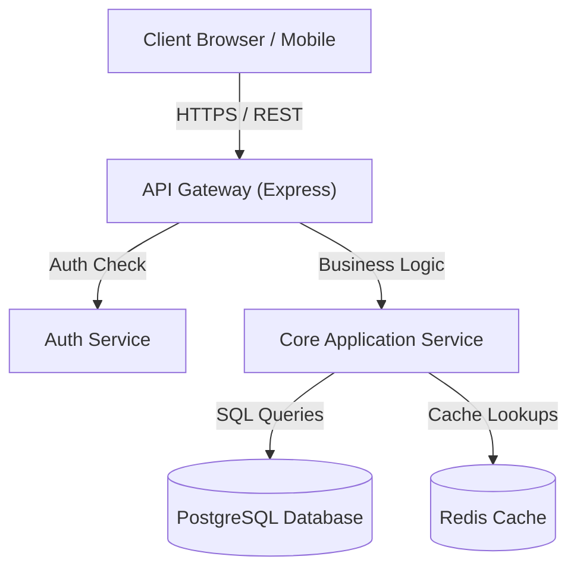
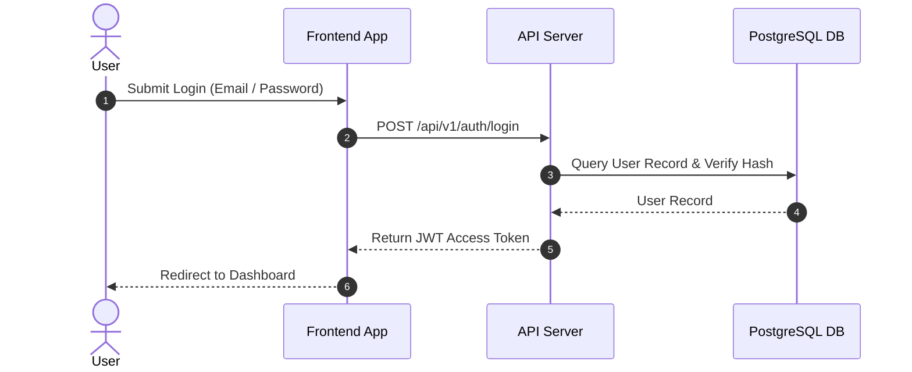
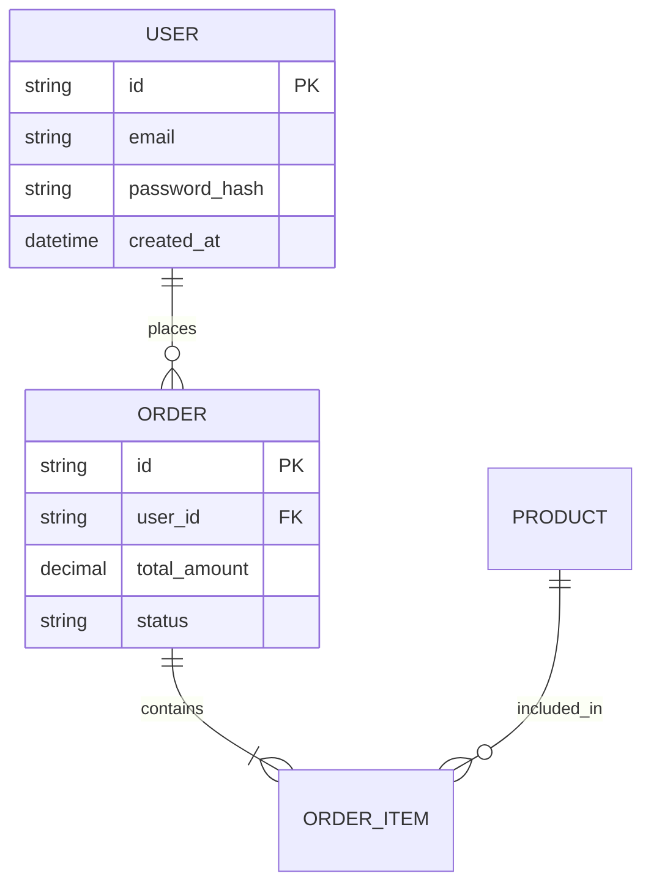

# Diagram Guidelines & Mermaid Standards

This guide specifies syntax, style, node labeling rules, and validation practices for producing evidence-based Mermaid diagrams.

---

## Mermaid Standard Rules

1. **Evidence-Based Nodes**: Every node in a diagram MUST correspond to an audited file, module, service, database, or external integration.
2. **Inferred Nodes**: If a node is inferred, clearly label it: `NodeName["Service Name (Inferred)"]`.
3. **No Decorative Diagrams**: Avoid clutter. Split large diagrams into concise sub-diagrams.
4. **Syntax Hygiene**:
   - Quote node labels containing special characters, brackets, or spaces: `id["Client App (React)"]`.
   - Never use raw HTML tags inside node text.
   - Use standard direction: `graph TD` or `graph LR`.
5. **No Secret Exposures**: Never include real passwords, tokens, or private credentials in diagram labels.

---

## Diagram Types & Templates

### 1. System Architecture Diagram

### 2. Authentication & Authorization Sequence Diagram

### 3. Entity-Relationship (ER) Diagram

