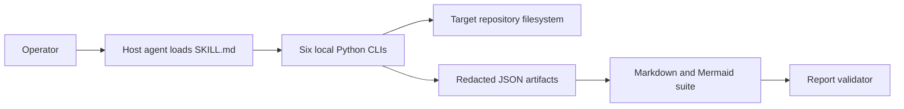

# RepoLens Research Inspector — Full Research Audit

**Repository:** `inspect-skill`  
**Mode:** Full Research Audit, 26-step workflow  
**Branch / commit:** `main` / `84cd5ed6be3dcc22b9e3347034246bc5a505f99c`  
**Audit date:** 2026-07-19  
**Baseline coverage:** 100% (22 analyzed / 22 discovered; 0 binaries excluded; 0 large files sampled)  
**Overall production-readiness score:** 56/100 (D/F — significant hardening required)

## 1. Executive Summary

RepoLens is a compact, standard-library-only Python agent skill for repository research. Six independent CLIs inventory files, identify technology signatures, map structure and route-like declarations, extract redacted line evidence, scan for secret-like values, and validate Markdown reports. All six repository tests passed and all Python files compiled on Python 3.11.9.

The project is well documented and easy to inspect, but it is not yet production-grade for high-assurance audit/security use. The most important defect is that the secret scanner can leave a sensitive value present in a supposedly redacted snippet when a regex's first capture is a label or protocol rather than the secret. Other material gaps include weak path containment, false-positive route detection from test fixtures, declared-but-unused import signatures, absent NOT FOUND category output, silent error swallowing, narrow report validation, and no packaging or CI/CD.

No live API, database, auth system, infrastructure, container, or CI/CD pipeline exists. The structure scan's `GET /api/users` result is demonstrably synthetic fixture text, not an endpoint. Detailed findings are in [SECURITY_AUDIT.md](project-documentation/SECURITY_AUDIT.md), [CODE_QUALITY_REPORT.md](project-documentation/CODE_QUALITY_REPORT.md), and [EVIDENCE_LEDGER.md](project-documentation/EVIDENCE_LEDGER.md).

## 2. Project Overview

The repository packages an `inspect-repository` agent skill plus deterministic support scripts and reference material. Its purpose and operating modes are stated in [SKILL.md](SKILL.md#L6). It is a local analysis tool, not a network service. See [PROJECT_OVERVIEW.md](project-documentation/PROJECT_OVERVIEW.md).

## 3. Problem Statement

The project addresses the difficulty of inspecting unfamiliar repositories consistently while grounding claims in files and lines, avoiding raw secret exposure, and producing reusable technical documentation. The master prompt states the intended exhaustive audit scope in [prompt.txt](prompt.txt#L1).

## 4. Project Objectives

Documented objectives are deterministic inventory, evidence-backed stack detection, architecture mapping, API/database/security analysis, editable Mermaid diagrams, ten-dimension scoring, modular documentation, and validation. These objectives are enumerated in [README.md](README.md#L28). Several are only partially implemented, particularly import detection, 28-category absence output, protocol coverage, and validation completeness.

## 5. Target Users

Primary users are AI-agent operators, senior engineers, security reviewers, architects, and maintainers who need a local repository audit. The installation targets global or project-local agent skill directories as shown in [README.md](README.md#L12).

## 6. User Roles

No application roles are implemented. Operationally, an operator selects a target and authorizes filesystem access; a host agent interprets the workflow and composes documentation; local Python scripts perform deterministic sub-analyses. The OS and host agent enforce access, not this repository.

## 7. Main Features

- File classification, size metrics, binary/large-file flags, and ignored-directory detection.
- Manifest/file-extension technology signatures and language counts.
- Entry-point, path-based module, and REST-like route discovery.
- Redacted line-range evidence extraction.
- Pattern/entropy-based secret auditing with classified findings.
- Markdown link and selected secret-pattern validation.
- Templates and references for diagrams, scoring, architecture, security, and reporting.

Feature declarations are in [README.md](README.md#L28); implementation boundaries are detailed in [MODULE_DOCUMENTATION.md](project-documentation/MODULE_DOCUMENTATION.md).

## 8. Repository Scope

The baseline inventory contains 22 files totaling 112,179 bytes (109.55 KiB): 13 documentation files, six source scripts, one test, one YAML configuration, and one license. All were text and below the 1 MiB large-file threshold. `.git` was present and pruned; no generated dependency/build directory was present. The machine-readable baseline is [.inventory.json](project-documentation/.inventory.json).

## 9. Branch and Commit Analyzed

The pre-documentation worktree was clean on branch `main` at full SHA `84cd5ed6be3dcc22b9e3347034246bc5a505f99c`; `git describe --tags --always` returned `84cd5ed`. Documentation generation then created `project-documentation/` and Python compilation created an ignored cache directory that is not part of the baseline inventory.

## 10. Technology Stack

Repository evidence supports Python 3.8+ as the documented baseline; audit execution used Python 3.11.9. Runtime code imports only the standard library. YAML provides agent metadata; Markdown and Mermaid provide instructions/artifacts. No dependency manifest or lock exists, so there are no third-party package versions to report.

All 28 audited categories, including explicit NOT FOUND outcomes, exact available version evidence, and confidence labels are in [TECHNOLOGY_STACK.md](project-documentation/TECHNOLOGY_STACK.md). The generated detector itself found only Python and labeled its version `Repo Standard` in [.tech_stack.json](project-documentation/.tech_stack.json).

## 11. Repository Structure

The root contains the skill contract, README, master prompt, license, one agent metadata file, assets, eight references, six scripts, and one test runner. There is no application entry point. See [REPOSITORY_STRUCTURE.md](project-documentation/REPOSITORY_STRUCTURE.md).

The inventory's exclusion set includes `node_modules`, `.git`, `dist`, `build`, `coverage`, `target`, virtual environments, caches, IDE folders, and common compiled-output directories at [inventory_repository.py](scripts/inventory_repository.py#L15).

## 12. Module Explanations

Each source file is an independent functional/CLI module. There is no package-level orchestration or shared domain layer. Inputs and outputs are local paths, JSON documents, stdout, stderr, and exit codes. Complete public interfaces and responsibilities are tabulated in [MODULE_DOCUMENTATION.md](project-documentation/MODULE_DOCUMENTATION.md).

## 13. Architecture

The architecture is a local script pipeline coordinated by an agent following prose instructions. JSON artifacts bridge analysis phases and report composition; Markdown is then validated.

The editable source is [system_architecture.mmd](project-documentation/diagrams/system_architecture.mmd), with analysis in [ARCHITECTURE.md](project-documentation/ARCHITECTURE.md).

## 14. Application Workflows

The full flow resolves scope and Git state; runs inventory, technology, structure, and secret analysis; collects targeted evidence; composes docs/diagrams; scores readiness; builds the ledger; validates reports; and reports coverage. The mandated sequence is in [inspection-workflow.md](references/inspection-workflow.md#L22). A local invocation/auth-applicability sequence is in [authentication_flow.mmd](project-documentation/diagrams/authentication_flow.mmd).

## 15. API Design

There is no network API. The apparent `GET /api/users` output in [.structure.json](project-documentation/.structure.json) originates from test fixture construction at [test_inspect_repository_scripts.py](test_inspect_repository_scripts.py#L83). CLI interfaces, required parameters, optional parameters, and exit behavior are documented in [API_DOCUMENTATION.md](project-documentation/API_DOCUMENTATION.md).

## 16. Database Design

No database engine, ORM, database file, schema, migration, query, index, or persisted domain entity exists. Database query performance and index coverage are therefore not applicable. The requested editable applicability diagram is [database_er.mmd](project-documentation/diagrams/database_er.mmd); see [DATABASE_DOCUMENTATION.md](project-documentation/DATABASE_DOCUMENTATION.md).

## 17. Authentication and Authorization

No application authentication, session, OAuth, token issuance, RBAC, or ABAC exists. The scripts rely on the invoking process's filesystem permissions. This makes host-agent authorization and strict root containment important; the current evidence collector's string-prefix boundary check is insufficient, as shown at [collect_code_evidence.py](scripts/collect_code_evidence.py#L44).

## 18. AI/ML Architecture

No AI/ML runtime, model, vector store, model API SDK, prompt execution engine, or agent framework dependency exists. The repository is metadata and instructions intended for use by an external AI agent; it does not itself call a model. Confidence: NOT FOUND based on [.tech_stack.json](project-documentation/.tech_stack.json) and complete inventory.

## 19. Configuration Management

The only configuration file is [agents/openai.yaml](agents/openai.yaml#L1), containing display metadata and a default prompt. Behavior is otherwise encoded as Python constants and CLI flags. There is no environment-file template, centralized config schema, secret manager integration, configuration layering, or environment separation.

## 20. Testing Strategy

The custom test runner creates temporary repositories and invokes each script through subprocesses. All six tests passed during the audit, and all Python files passed syntax compilation. There is no third-party test framework, coverage measurement, CI matrix, fuzzing, or security regression suite. See [TESTING_REPORT.md](project-documentation/TESTING_REPORT.md).

## 21. CI/CD

No GitHub Actions workflow, GitLab pipeline, Jenkinsfile, Azure pipeline, or other CI/CD definition exists in the baseline inventory. Tests and validation are documented commands only. Confidence: NOT FOUND based on [.inventory.json](project-documentation/.inventory.json).

## 22. Deployment

The project is cloned into an agent skill directory and invoked locally. There is no wheel, package metadata, container image, service definition, release automation, or signed artifact. The repository documents Python 3.8+ but does not pin dependencies or interpreter versions. See [DEPLOYMENT_GUIDE.md](project-documentation/DEPLOYMENT_GUIDE.md).

## 23. Logging and Monitoring

Scripts emit simple completion/error messages to stdout/stderr and JSON results. There is no structured logging, log level, run ID, duration metric, tracing, health check, alerting, or metrics export. Worse, broad exception handlers often continue silently, so skipped files can be invisible. Observability score: 25/100.

## 24. Security Assessment

The redacted baseline scan produced four low-severity test-fixture findings and zero suspected real credentials. However, capture-group handling can preserve the actual value in generic-assignment or connection-string snippets, so scanner output cannot yet be trusted as universally redacted. The validator also uses a narrower secret pattern set and scans Markdown only. Findings and OWASP applicability are in [SECURITY_AUDIT.md](project-documentation/SECURITY_AUDIT.md).

## 25. Code-Quality Assessment

Strengths include focused modules, readable names, deterministic local operation, standard-library-only dependencies, and consistent CLI shells. Material defects include unused import signatures, heuristic fixture false positives, missing evidence metadata for language findings, repeated tree scans, broad exception swallowing, duplicated policies, and stale/malformed README content. Code-quality score: 62/100. See [CODE_QUALITY_REPORT.md](project-documentation/CODE_QUALITY_REPORT.md).

## 26. Performance Assessment

The tools are adequate for this 22-file repository. Scalability risks arise because technology file-pattern detection walks the whole tree separately for each relevant signature, scanners read complete files into memory, and the full workflow walks the repository multiple times. Large-file handling is inconsistent: inventory flags files above a threshold, while the secret scanner silently skips files above 2 MiB. Performance score: 72/100.

## 27. Scalability Assessment

Execution is serial, local, non-incremental, and uncached. There is no concurrency, content hashing, resumability, streaming parser, bounded aggregate memory model, or distributed design. Those characteristics are acceptable for small repositories but risky for monorepos, despite documentation claiming monorepo support. Scalability score: 48/100.

## 28. Accessibility Assessment

There is no end-user UI, so WCAG interaction analysis is not applicable. Documentation accessibility is affected by mojibake in README emoji/tree characters at [README.md](README.md#L1), which reduces readability in some terminals. Markdown headings and tables otherwise provide reasonable semantic structure.

## 29. Production Readiness

| Dimension | Score |
|---|---:|
| Architecture | 68 |
| Code Quality | 62 |
| Security | 45 |
| Testing | 58 |
| Documentation | 82 |
| Performance | 72 |
| Scalability | 48 |
| Maintainability | 65 |
| Observability | 25 |
| Deployment Readiness | 30 |
| **Overall (unweighted mean)** | **56** |

Classification: D/F, significant hardening required for production audit/security use. Rationales and release gates are in [PRODUCTION_READINESS.md](project-documentation/PRODUCTION_READINESS.md).

## 30. Known Limitations

The detector does not execute its declared import signatures or emit all absent categories. Route detection is narrow and test-unaware. Module analysis is directory-name based rather than an import graph. Secret detection is regex/line based. Validation ignores non-Markdown artifacts and treats unsupported confirmed claims as nonfatal. Full limitations are in [RISKS_AND_LIMITATIONS.md](project-documentation/RISKS_AND_LIMITATIONS.md).

## 31. Technical Debt

Major debt includes duplicated traversal/exclusion/redaction logic, no shared output schemas or schema versions, no package metadata, no CI, no lint/type/coverage gate, a custom assertion-based test runner, and documentation claims that outpace tested implementation. The README references absent `quick_validate.py` at [README.md](README.md#L107).

## 32. Recommendations

Immediately make redaction output-safe and replace path-prefix containment. Then implement promised evidence behaviors, make validation failures enforceable, package the tool, add CI/coverage/security tests, consolidate shared policies, and benchmark monorepos. Detailed actions are in [RECOMMENDATIONS.md](project-documentation/RECOMMENDATIONS.md).

## 33. Prioritized Roadmap

| Priority | Outcome | Acceptance signal |
|---|---|---|
| P0 | Secret-safe output and strict root containment | Adversarial fixtures never appear in any serialized artifact; traversal/symlink tests pass |
| P1 | Evidence accuracy | Import scanning works; 28 categories always emitted; test fixtures excluded/tagged; validation is fail-closed |
| P2 | Engineering reliability | Package metadata, JSON Schemas, pytest, coverage, lint, typing, and multi-version CI are green |
| P3 | Scale/release | Single-pass cached walk, benchmarks, versioned signed releases, and support/security policy exist |

The implementable task list is in [RECOMMENDATIONS.md](project-documentation/RECOMMENDATIONS.md).

## 34. Evidence Index

The separate ledger contains 35 key claims with exact file/line evidence, confidence, and validation state: [EVIDENCE_LEDGER.md](project-documentation/EVIDENCE_LEDGER.md). Deterministic raw artifacts are [.inventory.json](project-documentation/.inventory.json), [.tech_stack.json](project-documentation/.tech_stack.json), [.structure.json](project-documentation/.structure.json), and [.secret_audit.json](project-documentation/.secret_audit.json). Redacted targeted evidence is stored under [project-documentation/.evidence](project-documentation/.evidence).

## 35. Glossary

| Term | Meaning in this report |
|---|---|
| Agent skill | Instructions and assets loaded by an external AI-agent host. |
| Baseline inventory | Repository state before generated documentation and compilation cache were added. |
| Explicitly evidenced | Direct repository evidence supports the claim; this is the ledger's highest confidence level. |
| HIGH/MEDIUM/LOW | Decreasing levels of indirect/inferred support. |
| NOT FOUND | Category explicitly searched with no supporting repository evidence. |
| Evidence ledger | Claim-to-path/line/confidence mapping. |
| Fixture | Synthetic content created by tests; not live application behavior. |
| Redaction | Replacement or masking of a potentially sensitive value before output. |
| Production readiness | Suitability for dependable organizational use, not merely successful local execution. |
